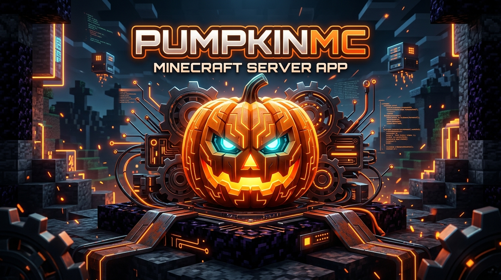

<div align="center">



# 🎃 PumpkinMC Host for Android
### *Native ARM64 Rust Minecraft Server Engine & Management Daemon*

[](https://github.com/SSIT2051/pumpkinmc-host/actions/workflows/build-apk.yml)
[](https://github.com/Pumpkin-MC/Pumpkin)
[](https://github.com/SSIT2051/pumpkinmc-host)
[%20%2B%20Bedrock%20(UDP)-blueviolet.svg?style=flat-square)](https://github.com/SSIT2051/pumpkinmc-host)
[](https://github.com/journey-ad/Moe-Counter)
[](LICENSE)

<br />

<!-- Moe-Counter Anime Visitor Counter (Powered by https://github.com/journey-ad/Moe-Counter) -->
<table align="center">
  <tr>
    <td align="center" style="background-color: #12100E; border: 1px solid #2A241E; border-radius: 14px; padding: 16px;">
      
      <br /><br />
      <sub><b>✨ Visitor Counter (Powered by <a href="https://github.com/journey-ad/Moe-Counter">Moe-Counter</a>) ✨</b></sub>
      <br /><br />
      <a href="https://github.com/journey-ad/Moe-Counter">
        
      </a>
    </td>
  </tr>
</table>

<p><em>Turn any modern Android smartphone or tablet into a lightning-fast, 20.0 TPS locked Minecraft server with zero JVM overhead.</em></p>

</div>

---

## 📑 Table of Contents

1. [Introduction & What It Does](#-introduction--what-it-does)
2. [Application Architecture](#-application-architecture)
3. [Key Attributes & Technical Specifications](#-key-attributes--technical-specifications)
4. [How Things Work (Under the Hood)](#-how-things-work-under-the-hood)
5. [Interface Showcase](#-interface-showcase)
6. [Fully Detailed User Manual](#-fully-detailed-user-manual)
   - [First Launch & Server Creation](#1-first-launch--server-creation)
   - [Starting, Stopping & Restarting](#2-starting-stopping--restarting)
   - [Connecting via Local Wi-Fi (LAN)](#3-connecting-via-local-wi-fi-lan)
   - [Connecting via Bedrock (MCPE) vs. Java (PC)](#4-connecting-via-bedrock-mcpe-vs-java-pc)
   - [Configuring Custom Addresses & Reverse Proxies](#5-configuring-custom-addresses--reverse-proxies)
   - [Global Access via Playit.gg Tunnel](#6-global-access-via-playitgg-tunnel)
   - [Live Interactive Console & Commands](#7-live-interactive-console--commands)
   - [In-App Configuration & File Manager](#8-in-app-configuration--file-manager)
   - [WebAssembly (WASM) Plugin Marketplace](#9-webassembly-wasm-plugin-marketplace)
   - [Instant 1-Tap Hardware Auto-Tune](#10-instant-1-tap-hardware-auto-tune)
7. [Troubleshooting & Diagnostics Guide](#-troubleshooting--diagnostics-guide)
8. [Building from Source](#-building-from-source)
9. [Contributing Guidelines](#-contributing-guidelines)
10. [Code of Conduct](#-code-of-conduct)
11. [License & Disclaimers](#-license--disclaimers)

---

## 🌟 Introduction & What It Does

**PumpkinMC Host** is an all-in-one Android application that bundles and orchestrates **[PumpkinMC](https://github.com/Pumpkin-MC/Pumpkin)**, a cutting-edge Minecraft server written entirely in **100% native Rust**.

Historically, attempting to host a Minecraft world on an Android device meant running heavy Java runtimes (JRE) or emulation layers like Termux/PRoot. These setups suffer from:
- Crushing memory usage (often requiring 2.5 GB to 4 GB of RAM just to idle).
- Frequent "stop-the-world" Garbage Collection pauses that cause severe stuttering in-game.
- Rapid battery depletion and extreme device heating.
- Unavoidable process termination by the Android OS Low Memory Killer (LMK).

**PumpkinMC Host solves this permanently.** By compiling directly to native ARM64 machine code (`aarch64-linux-android`), the engine runs bare-metal on the Linux kernel powering Android. It consumes as little as **25 MB to 35 MB of RAM**, boots in less than **800 milliseconds**, and maintains a stable **20.0 TPS** tick rate even on budget devices.

---

## 🏛️ Application Architecture

The system operates across three coordinated layers: the modern Jetpack Compose UI, the Android OS foreground background daemon, and the native Rust runtime engine:

```
┌─────────────────────────────────────────────────────────────────────────────┐
│                    JETPACK COMPOSE USER INTERFACE (KOTLIN)                  │
│  • Dashboard Screen (IP Banner, TPS Gauge, Controls, 1-Tap Auto-Tune)      │
│  • Live ANSI Console (Command Dispatcher, Autocomplete, Log Filter)        │
│  • Server Configuration Editor (server.toml, world rules, ports)            │
│  • File Manager & In-App Text/JSON/TOML Editor                             │
│  • WASM Plugin Marketplace (One-Tap Install, Hot-Reloading)                │
└──────────────────────────────────────┬──────────────────────────────────────┘
                                       │ StateFlow / Coroutines
┌──────────────────────────────────────▼──────────────────────────────────────┐
│                  ANDROID FOREGROUND SERVICE & DAEMON MANAGER                │
│  • CPU Partial WakeLock (Prevents OS deep-sleep CPU throttling)            │
│  • Process Lifecycle Supervisor (Auto-restart on crash, IPC pipe monitor)  │
│  • Hardware Metrics Collector (/sys/devices/system/cpu, /proc/meminfo)     │
│  • Room SQLite Persistence (Server profiles, world states, plugin caches)  │
└──────────────────────┬───────────────────────────────┬──────────────────────┘
                       │ Fork/Exec IPC (stdin/stdout)  │
┌──────────────────────▼──────┐         ┌──────────────▼──────────────────────┐
│    NATIVE PUMPKINMC ENGINE   │         │       NETWORK & CROSSPLAY LAYER      │
│ • Tokio Async Event Loop    │         │ • Local Wi-Fi IP Auto-Detector       │
│ • Rayon Chunk Threadpool    │         │ • Bedrock RakNet UDP Bridge (19132)  │
│ • Sub-35MB Baseline Memory  │         │ • Java Edition TCP Sockets (25565)   │
│ • RAII Compile-Time Safety  │         │ • Playit.gg Encrypted Public Tunnel  │
└─────────────────────────────┘         └──────────────────────────────────────┘
```

### Component Breakdown
1. **Frontend (Jetpack Compose & M3)**: Reactive UI following Clean Architecture and MVVM patterns. It continuously listens to state streams for live TPS, memory consumption, player lists, and console output.
2. **Foreground Service Daemon (`PumpkinServerService`)**: Keeps the server running when the user switches to other apps or locks the phone. Holds a `PARTIAL_WAKE_LOCK` to ensure the CPU remains at active frequency during game sessions.
3. **Rust Engine Binary (`pumpkin-arm64`)**: The native executable running directly in the app's internal storage sandbox (`/data/data/com.example/files/servers/...`).
4. **Network Bridge**: Handles dual-protocol translation so Bedrock (MCPE) and Java (PC) players can explore the same world simultaneously.

---

## ⚡ Key Attributes & Technical Specifications

| Feature / Attribute | PumpkinMC Host (Native Rust) | Traditional Mobile JVM Host |
| :--- | :---: | :---: |
| **Idle Memory (RAM)** | **~25 MB – 35 MB** | 1,800 MB – 3,500 MB |
| **Server Startup Time** | **< 800 milliseconds** | 45 – 90 seconds |
| **Garbage Collection (GC)** | **0 ms (None)** | Stop-the-world spikes (100ms - 2s) |
| **Cross-Platform Play** | **Native Built-In (UDP 19132)** | Requires heavy Java plugins |
| **CPU Utilization** | Asynchronous Tokio Work-Stealing | Synchronous Thread-per-Client |
| **Battery Consumption** | Low (Adaptive idle tick-rate) | Severe (Constant heap GC cycles) |
| **Minimum Hardware** | Android 7.0+ (ARM64, 2GB RAM) | Android 10+ (6GB+ RAM recommended) |
| **Configuration Files** | Standard `server.toml` | `server.properties` |
| **Extensibility** | WebAssembly (WASM) Plugins | Heavy JAR Plugins |

---

## 🔬 How Things Work (Under the Hood)

### 1. Zero-Virtualization Native Execution
Instead of running a Linux emulator or Java VM, PumpkinMC Host packages a native binary compiled targeting `aarch64-linux-android`. The binary is extracted to the app's protected internal storage directory (`Context.filesDir`), given execution permissions (`chmod 755`), and spawned via Unix `fork()` and `execve()`. Standard input and output streams are attached to an asynchronous coroutine pipe that feeds the in-app terminal console.

### 2. Tokio Asynchronous Networking
PumpkinMC uses the **Tokio** runtime. Unlike traditional servers that dedicate a blocking operating system thread to every connected client, Tokio multiplexes thousands of network sockets over a small pool of worker threads. Incoming packets are processed as lightweight tasks, yielding CPU cycles when waiting for network I/O.

### 3. Rayon Work-Stealing Chunk Engine
Terrain generation, block updates, and physics ticks are managed using **Rayon**. Rayon creates a work-stealing threadpool configured dynamically to match your device's physical CPU cores. If one core finishes its world generation tasks early, it steals pending chunks from another core's queue, preventing frame drops and chunk rendering lag.

### 4. Dual-Protocol Crossplay (Java + Bedrock)
Minecraft Java Edition uses TCP framing, while Minecraft Bedrock (Pocket Edition on phones, tablets, and consoles) utilizes RakNet over UDP. PumpkinMC Host runs a synchronized RakNet bridge on UDP port `19132` that parses Bedrock packets and maps them to the server world state alongside incoming Java TCP connections on port `25565`.

### 5. OS WakeLock & Thermal Management
Android aggressively throttles background processes and puts CPU cores into deep C-states to conserve battery. PumpkinMC Host uses an Android Foreground Service tied to a system notification and acquires a `PowerManager.PARTIAL_WAKE_LOCK`. This guarantees the CPU maintains active clock cycles for the tick loop without waking the display.

---

## 📱 Interface Showcase

<div align="center">
  
  <p><sub><em>Clean Obsidian Material 3 Interface with Prominent IP Banner, 20.0 TPS Meter, and Quick Controls</em></sub></p>
</div>

---

## 📖 Fully Detailed User Manual

### 1. First Launch & Server Creation
1. Open the **PumpkinMC Host** application on your Android device.
2. If this is your first time, you will see the **No Server Deployed** screen.
3. Tap **Create New Server**.
4. Configure your server:
   - **Server Name**: Choose a friendly label (e.g., `Survival World`).
   - **Java Port**: Default is `25565`.
   - **Bedrock Port**: Default is `19132`.
   - **Max Players**: Select between 2 and 50 players.
   - **Game Mode**: Survival, Creative, Adventure, or Spectator.
5. Tap **Create Server**. The app generates the isolated directory structure, default `server.toml`, and world databases.

### 2. Starting, Stopping & Restarting
- **Start**: Tap the glowing orange **Start Server** button. The status badge will switch to `● RUNNING` and the TPS meter will lock onto `20.0 TPS`.
- **Stop**: Tap the **Stop** button. The app sends a graceful `/stop` signal to the engine, saving chunk data to disk before terminating the process.
- **Restart**: Tap **Restart** to cycle the server cleanly and apply newly updated configuration options.

### 3. Connecting via Local Wi-Fi (LAN)
This is the recommended and simplest method for playing with friends at home or at school:
1. Ensure your phone and your friends' devices (phones, tablets, PCs) are connected to the **same Wi-Fi network** or to your **phone's mobile hotspot**.
2. Look at the **Server Address & Ports** card at the top of the dashboard.
3. The card automatically detects and displays your phone's active Wi-Fi IP address in large, bold monospace text (e.g., `192.168.1.150`).
4. Tap **Copy IP** to copy the address to your clipboard.

### 4. Connecting via Bedrock (MCPE) vs. Java (PC)

#### For Minecraft Bedrock / Pocket Edition (Android, iOS, iPadOS, Windows 10, Consoles):
1. Open **Minecraft** on the client device.
2. Tap **Play** > Navigate to the **Servers** tab > Scroll down and tap **Add Server**.
3. **Server Name**: Enter any name (e.g. `Mobile Server`).
4. **Server Address**: Enter the Wi-Fi IP address shown on the dashboard (e.g., `192.168.1.150`).
5. **Port**: Enter **`19132`** (the dedicated UDP Bedrock port).
6. Tap **Save** and tap **Join Server**!

#### For Minecraft Java Edition (PC / Mac / Linux):
1. Open Minecraft Java Edition.
2. Go to **Multiplayer** > **Direct Connection** (or **Add Server**).
3. **Server Address**: Enter the Wi-Fi IP and port separated by a colon: `192.168.1.150:25565`.
4. Tap **Join Server**!

### 5. Configuring Custom Addresses & Reverse Proxies
If you are running an Ngrok tunnel, Cloudflare TCP tunnel, or have a home router with port-forwarding:
1. On the dashboard's connection card, tap the **Custom Address** route pill.
2. An inline text box appears: **Custom Domain / IP Address**.
3. Enter your public hostname or address (e.g., `mc.yourdomain.com` or `0.tcp.ngrok.io:12345`).
4. The dashboard immediately updates the Bedrock and Java shareable cards with your custom address.

### 6. Global Access via Playit.gg Tunnel
Playit.gg allows friends anywhere in the world to join your server over the internet without needing router access or port-forwarding:
1. On the connection card, tap **Global (Playit)**.
2. The dashboard displays your assigned global tunnel domain (e.g. `pumpkin-srv.playit.gg`).
3. Share this domain with friends outside your local Wi-Fi.

### 7. Live Interactive Console & Commands
Tap the **Console** tab at the bottom of the screen:
- **Live Output**: Real-time terminal output with ANSI color highlighting for INFO, WARN, and ERROR levels.
- **Command Dispatcher**: Type any Minecraft command in the bottom input bar (e.g., `op Steve`, `gamemode creative`, `weather clear`, `time set day`).
- **Quick Command Chips**: One-tap action chips for frequent administrative actions.
- **Export Logs**: Copy or save the complete session log file with one tap.

### 8. In-App Configuration & File Manager
Tap the **Files** tab:
- Browse server directories (`world`, `plugins`, `logs`).
- Tap any text, JSON, or TOML file (such as `server.toml` or `ops.json`) to open the built-in syntax-highlighted editor.
- Modify values directly on your phone and tap **Save**.

### 9. WebAssembly (WASM) Plugin Marketplace
Tap the **Plugins** tab:
- Explore pre-compiled WASM extensions (Essentials, Economy, WorldEdit, LandClaim).
- Tap **Install** to download and place the plugin directly into your server's `plugins/` folder.
- Restart the server to activate the plugin with zero memory bloat.

### 10. Instant 1-Tap Hardware Auto-Tune
Located directly on the server dashboard under the **Hardware & Performance** card:
1. Tap the glowing **⚡ Auto-Tune** button.
2. The application queries `/proc/cpuinfo` and system memory tables in real time.
3. It detects your device's physical CPU cores (big.LITTLE topology), available system RAM, and free storage.
4. It instantly calculates and applies the optimal number of Tokio network worker threads, Rayon chunk threads, and view distances—reserving enough RAM for the Android OS to prevent thermal throttling and background kills.

---

## 🔧 Troubleshooting & Diagnostics Guide

### 1. "Can't connect to server" on Bedrock Edition
- **Verify Same Network**: Ensure both the host phone and client device are on the exact same Wi-Fi SSID or connected to the phone's mobile hotspot.
- **Check Port Number**: Make sure Bedrock players are using Port **`19132`** (not `25565`).
- **AP Isolation**: Some public or school Wi-Fi routers enable "Client/AP Isolation", preventing connected devices from talking to each other. If this occurs, enable your phone's **Mobile Hotspot** and have your friends connect to that instead.

### 2. "Wrong Format" Error in Minecraft
- Do not include the port number inside the "Server Address" field on Bedrock Edition.
- Place the IP address (e.g. `192.168.1.150`) in **Server Address**, and the port (`19132`) in the dedicated **Port** box.

### 3. Server Stops When the Screen Turns Off
- On aggressive battery-saving Android skins (MIUI, HyperOS, ColorOS, OneUI), battery optimization may terminate background services:
  1. Open Android **Settings** > **Apps** > **PumpkinMC Host**.
  2. Tap **Battery** > Set to **Unrestricted** (Don't optimize).
  3. Allow **Autostart / Background Running** permissions if available.

### 4. "Address already in use" (Port Conflict)
- If port `25565` or `19132` is occupied by another application, open the dashboard settings, edit the server configuration, change the port to `25566` or `19133`, and tap **Save Changes**.

---

## 🛠️ Building from Source

### Prerequisites
- Android Studio Ladybug (2024.2.1+) or newer
- Java Development Kit (JDK) 17
- Android SDK Platform 35 and NDK r26+
- Rust toolchain (`rustup target add aarch64-linux-android`)

### Compilation Steps

```bash
# 1. Clone the repository
git clone https://github.com/SSIT2051/pumpkinmc-host.git
cd pumpkinmc-host

# 2. Build Debug APK
./gradlew assembleDebug

# 3. Build Release APK (requires release signing keys in environment)
./gradlew assembleRelease
```

The compiled APK will be generated at `app/build/outputs/apk/debug/app-debug.apk`.

---

## 🤝 Contributing Guidelines

Contributions are warmly welcomed! To contribute:
1. Fork the repository on GitHub.
2. Create a feature branch: `git checkout -b feature/my-new-feature`.
3. Commit your changes with clear, descriptive commit messages.
4. Push your branch: `git push origin feature/my-new-feature`.
5. Open a Pull Request detailing your changes and test results.

---

## 📜 Code of Conduct

This project adheres to the **Contributor Covenant Code of Conduct**. By participating in this project, you agree to abide by its terms:

- **Our Pledge**: We pledge to make participation in our project a harassment-free experience for everyone, regardless of age, body size, disability, ethnicity, gender identity, level of experience, nationality, race, religion, or sexual orientation.
- **Our Standards**: Demonstrate empathy, use welcoming and inclusive language, be respectful of differing viewpoints, and give and gracefully accept constructive criticism.
- **Enforcement**: Project maintainers have the right and responsibility to remove, edit, or reject comments, commits, code, and issues that are not aligned with this Code of Conduct.

---

## ⚖️ License & Disclaimers
 
This project is free software licensed under the terms of the **GNU General Public License v3.0 (GPLv3)**. See [LICENSE](LICENSE) for the full license text.

**Disclaimer**: *PumpkinMC Host is an independent, open-source project and is not affiliated with, endorsed by, or associated with Mojang Studios, Microsoft Corporation, or the upstream PumpkinMC organization. Minecraft is a registered trademark of Mojang Synergies AB.*
